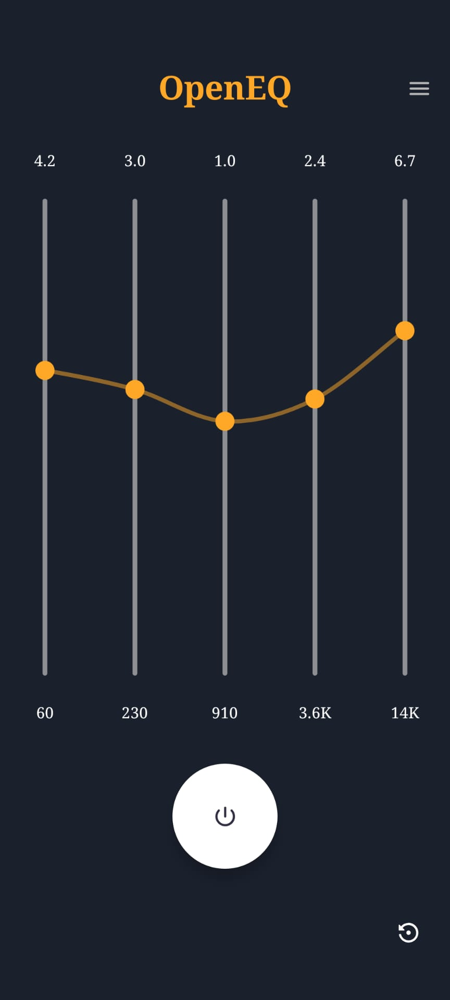
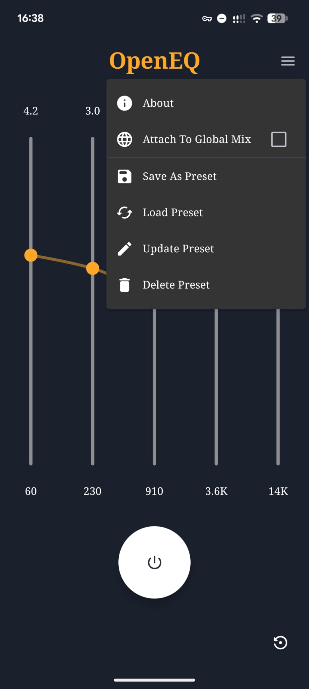
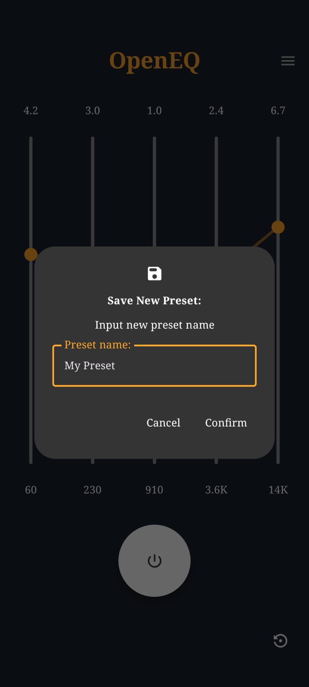

# OpenEQ #

This is the repository for OpenEQ, an open-source, privacy respecting, and simple Android audio equalizer app. 

  

### Features: ###

 - An equalizer that adapts to what the audio hardware on your phone supports
 	- Many common equalizers advertise a certain number of bands, but in reality don't always offer you that level of control as your phone simply doesn't support it. This equalizer adapts to and offers you only what is supported by your phone
 - Privacy respecting
 	- Many common equalizers contain tracking libraries, advertising, or require a subscription. This project doesn't, and never will, do any of these.
 - Simple and clean UI
 - User-defined equalizer presets
 - Fast and lightweight

### Installation: ###

Please go to the [releases page](https://github.com/Turbofan3360/OpenEQ/releases) to download the .apk which you can then install. I intend to get this app on F-Droid in the future, and potentially on the Google Play Store, but I want to complete some more development first.

### Compatibility: ###

Some media players require extra configuration to ensure they interface properly with the equalizer. The known ones are:

**Deezer:** Open sound settings bottom left → Equalizer → "Activate"

**Musicolet:** Three dots → Settings → Audio → Equalizer → "System Equalizer"

**Neutron:** Settings → Audio Hardware → "Enable DSP Effect (Device)" → Confirm

**BlackPlayer:** Hamburger menu → Audio → Equalizer → "Default Equalizer"

The "Attach To Global Mix" option is not available on all devices (it's technically a deprecated Android function, but still works on many devices and can be useful). Enabling this is required for the equalizer to function with some apps such as VLC, but this is device-specific.

### Features in development: ###

 - Presets for different music styles

### Known limitations/issues: ###

 - Only detects media streams starting after activating the equalizer (when "Attach To Global Mix" not enabled)
 - Doesn't work with all apps - some apps don't notify the system when starting a media stream, and so the equalizer can't attach to them (see [Compatibility](#Compatibility))
 - Requires Android 8.0 or higher

### Contributing: ###

I'm more than happy to have people contribute to this project! Please feel free to get in touch via email if you want.

### License: ###

This project is licensed under the [GNU General Public License Version 3](LICENSE)
